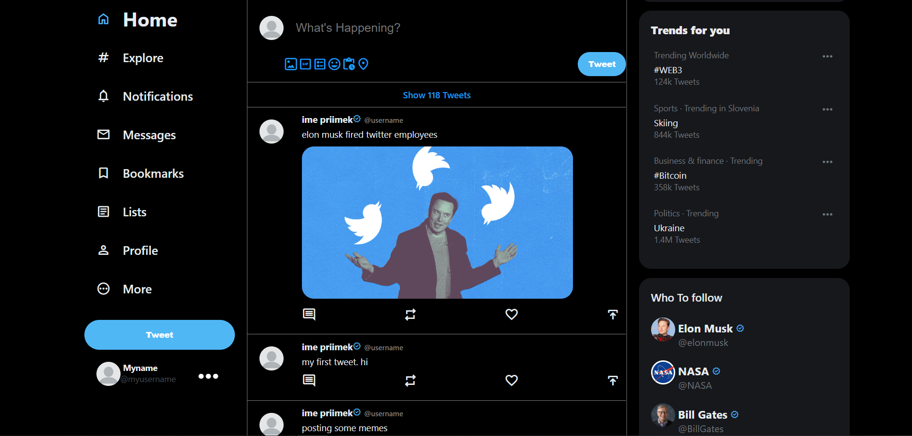

# Twitter clone

1. Import database tables structure (file `db_tables_structure.sql`).
2. Create file `config.php` in `server` folder and write your data for MySQL connection (host, username, password, database name).
3. Start your preferred web server.
4. Create `.env` file in `server` folder and define your `JWT_SECRET`.
5. Create `.env` file  in `client` folder and define your `REACT_APP_API_URL`.
6. Run `npm install` in `client` folder to get `node_modules`.
7. Run `npm start` in `client` folder.

